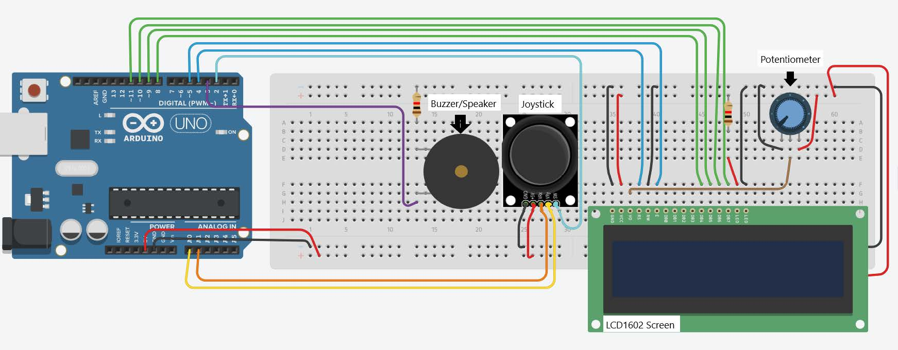

# Arduino Wordle Game

### Created By Jeff Purdy

### Demo Video: https://www.youtube.com/watch?v=XyiMS7zxfCw 

## System Design:  

## Project Disctription:
This project is a simpled wordle using the Joystick, LCD Display, and the Buzzer. Worlde is a word guessing game.
- The basic behavior is as follows:
  - Correct words are 5 letters long
  - The user has has 6 guesses
  - Use a randomized bank of 10 5-letter words
  - The first 5 spaces of the first row will be where the user selects letters
  - The 6th space should use a character to represent "ENTER" of some kind
    - The user will select this space with the joystick button to enter the users guess
  - When a user enters in a guess
    - use a blank spot in the word to indicate a letter not used at all
    - use a special character (pick any) to indicate a letter used, in the wrong position
    - use a different special character to display a letter at the correct position
    - This will stay displayed until the user clicks the joystick again
  - The cursor should blink wherever it is at
  - The joystick should control the cursor
  - The user can move the cursor to any point on the 5 spaces of the wordle
  - Clicking the joystick button while highlighting a space will bring up a letter selection screen
    - This letter selection screen shows all alphabetical letters on the screen
    - Use the joystick to select the letter
    - This letter will now appear on the space
    - The user can click a selected letter again to change, if they have not confirmed their guess.
  - Once the user has selected a letter for every space, the user can hit the "ENTER" button toconfirm their guess
  - Display on the second row the following information in some capacity:
    - Number of tries left
    - Confirmed Letters at known location
    - Confirmed letters without a known location
  - Musical Game End
    - If the user fails, Play a funny or sad tune on the buzzer, at least 3 notes
    - If the user succeeds, Play a happy tune, at least 3 notes
    - Reset the game after the song ends & the user clicks the joystick button
